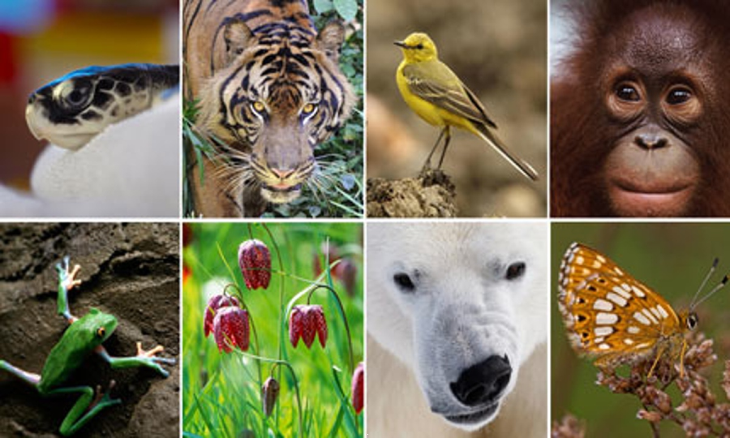

## About me


> - http://dlizcano.github.io
> - De: Cucuta, Colombia
> - Biólogo (Uniandes, Bogotá)
> - DICE, University of Kent 
> - Actualmente en: ULEAM, Manta
> - [Fauna de manabi](https://faunamanabi.github.io)
> - [TEAM Network](http://www.teamnetwork.org/user/1082)
> - [IUCN/SSC Tapir Specialist Group](http://www.tapirs.org/committees/index.html)
> - Mountain Tapir 


# La Ecología: Estudio de las interacciones que determinan la distribución y abundancia {.build}


## Contar Animales

Facil para animales que conspicuos que se agrupan.


## Contar Animales

, No tan facil si no se agrupan. Metodos de Captura - Marca - Recaptura. Distance


## Contar Animales

, Para algunas especies es engorroso, poco practico y muy costoso


## another

Slide With text and Image Below
===



## Slide with Bullets

- Bullet 1
- Bullet 2
- Bullet 3

## Slide with R Output

```{r cars, echo = TRUE}
summary(cars)
```

## Slide with Plot

```{r pressure}
plot(pressure)
```

