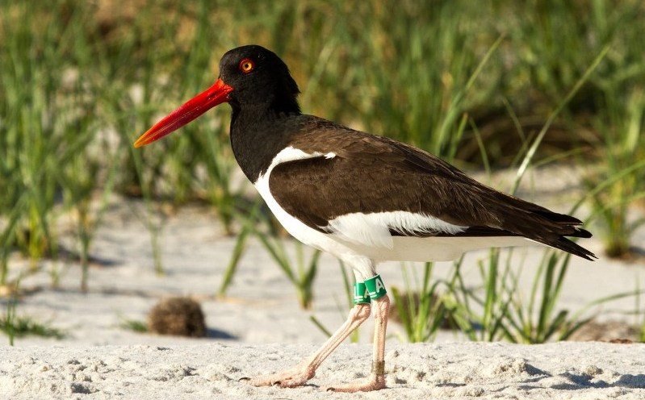

## About me


> - http://dlizcano.github.io
> - De: Cucuta, Colombia
> - Biólogo (Uniandes, Bogotá)
> - DICE, University of Kent 
> - Actualmente en: ULEAM, Manta
> - [Fauna de manabi](https://faunamanabi.github.io)
> - [TEAM Network](http://www.teamnetwork.org/user/1082)
> - [IUCN/SSC Tapir Specialist Group](http://www.tapirs.org/committees/index.html)
> - Mountain Tapir 


# La Ecología: | Estudio de las interacciones que determinan la _distribución y abundancia_ {.build}


## Contar Animales

Facil para animales que conspicuos que se agrupan.


## Contar Animales

, No tan facil si no se agrupan. Metodos de Captura - Marca - Recaptura. Distance


## Contar Animales

Para algunas especies es engorroso, poco practico y muy costoso


# Abundancia relativa | Una variable indicadora del estado de la población {.build}


## Los muestreos no son infalibles

<div class="centered">

</div>

La detectabilidad depende de:

  1. Las condiciones del muestreo (clima, hora)
  2. La habilidad del observador (sensor)
  3. La biologia de la especie que se muestrea
  
Este error debe considerarse para evitar sesgos en las estimaciones de abundancia.

# Mackenzie et al 2002, 2006 al rescate

## Libro y programa presence


Populariza la ocupacion ($\psi$) como proxi de la abundancia teniendo en cuenta la detectabilidad (p)

## La ocupación ($\psi$)

Proporción del área muestreada que esta ocupada por la especie.  

Visitando el sitio varias veces puedo estar mas seguro. 


```{r eval=TRUE, echo=FALSE}
library(knitr)
muestreo<-c("visita_1","visita_2", "visita_3", "visita_4")
Sitio<-c("sitio_1", "sitio_2", "sitio_3", "sitio_X")
mat<-matrix(c(1,0,1,0,
              0,0,1,0,
              0,0,0,0,
              1,0,0,0),nrow=4,ncol = 4)
colnames(mat)<-muestreo
rownames(mat)<-Sitio
kable(mat,booktabs=TRUE,longtable=TRUE)
```

## Calculo de ($\psi$) y p

- Ejemplo

<div class="columns-2">
```{r eval=TRUE, echo=FALSE}
library(knitr)
muestreo<-c("v_1","v_2", "v_3", "v_4")
Sitio<-c("sitio_1", "sitio_2", "sitio_3", "sitio_X")
mat<-matrix(c(1,0,1,0,
              0,0,1,0,
              0,0,0,0,
              1,0,0,0),nrow=4,ncol = 4)
colnames(mat)<-muestreo
rownames(mat)<-Sitio
kable(mat,booktabs=TRUE)
```

  
  
  
```{r eval=FALSE, echo=TRUE, message=FALSE, warning=FALSE}
.
   
Historias de deteccion


Pr(H1=1001)= ψ × p1(1–p2)(1–p3)p4

Pr(H2=0000)= ψ × (1-p1)(1–p2)(1–p3)(1–p4)

Pr(H3=1100)= ψ × p1p2(1–p3)(1–p4)

Pr(H4=1100)= ψ × p1p2(1–p3)(1–p4)

                

```
</div>

> - Las historias de deteccion se combinan en un modelo de maxima verosimlitud 

## Modelo de maxima verosimilitud


```{r tab, echo=FALSE, results='asis'}
library(xtable)
probabilidad<-c("Pr(H1=1001)",
      "Pr(H2=0000)",
      "Pr(H3=1100)",
      "Pr(H4=0000)")

historia_deteccion<- c("  psi × p1(1–p2)(1–p3)p4",
      "  psi × (1-p1)(1–p2)(1–p3)(1–p4)",
      "  psi × p1p2(1–p3)(1–p4)",
      "  psi × p1p2(1–p3)(1–p4)")

tab<-cbind(probabilidad, historia_deteccion)
fm1.table<- xtable(tab, caption = NULL)               
kable(fm1.table, type = "html")

```
  

Combina todas las historias de deteccion en:

$L (\psi, p \mid H_{1}, ...H_{x}) =  \prod_{i=1}^{x} Pr (H_{i})$
  

Se resuelve con algebra y calculo integral

## Ventajas de maxima verosimilitud

> - Relativamente fáciles de resolver en R
> - Permite incorporar covariables para explicar la heterogeneidad de $\psi$ y p
> - Permiten chequear que tan buen ajuste tiene el modelo
> - Se acopla fácilmente al procedimiento de selección de modelos usando el AIC


Una forma alternativa de estimar los parametros es con metodos Bayesianos. Mas detalles mas adelante...

